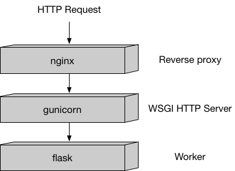

# SageMaker Bring Your Own Docker

An example that demonstrates how to bring your custom model written in a framework of your choice as docker image to SageMaker.  

We are using scikit-learn K Means algorithm as an example to do unsupervised clustering. 

**Note** SageMaker now includes a pre-built scikit container. We recommend the pre-built container be used for almost all cases requiring a scikit algorithm.

This repository covers 
* Local development and testing
* Training on SageMaker
* Deployment using SageMaker Endpoints 


### How Amazon SageMaker runs your Docker container

SageMaker requires the image to have a specific folder structure. Because you can run the same image in training or hosting, Amazon SageMaker runs your container with the argument train or serve. 

`train` holds the logic for training the model and storing the trained model. If the train file runs without failures, it will save a model (i.e. pickle file) to /opt/ml/model directory.

`serve` essential runs the logic written in `predictor.py `as a web service using Flask, that will listen to any incoming requests, invoke the model, make the predictions, and return a response with the predictions.

## Training 
When Amazon SageMaker runs training, your train script is run just like a regular Python program. A number of files are laid out for your use, under the /opt/ml directory:

```
/opt/ml
|-- input
|   |-- config
|   |   |-- hyperparameters.json
|   |   `-- resourceConfig.json
|   `-- data
|       `-- <channel_name>
|           `-- <input data>
|-- model
|   `-- <model files>
`-- output
    `-- failure
```
**The input**

* `/opt/ml/input/config` contains information to control how your program runs. `hyperparameters.json` is a JSON-formatted dictionary of hyperparameter names to values. These values will always be strings, so you may need to convert them. `resourceConfig.json` is a JSON-formatted file that describes the network layout used for distributed training. Since scikit-learn doesn't support distributed training, we'll ignore it here.

* `/opt/ml/input/data/<channel_name>/` (for File mode) contains the input data for that channel. The channels are created based on the call to CreateTrainingJob but it's generally important that channels match what the algorithm expects. The files for each channel will be copied from S3 to this directory, preserving the tree structure indicated by the S3 key structure.

* `/opt/ml/input/data/<channel_name>_<epoch_number>` (for Pipe mode) is the pipe for a given epoch. Epochs start at zero and go up by one each time you read them. There is no limit to the number of epochs that you can run, but you must close each pipe before reading the next epoch.

**The output**

* `/opt/ml/model/` is the directory where you write the model that your algorithm generates. Your model can be in any format that you want. It can be a single file or a whole directory tree. SageMaker will package any files in this directory into a compressed tar archive file. This file will be available at the S3 location returned in the DescribeTrainingJob result.

* `/opt/ml/output` is a directory where the algorithm can write a file failure that describes why the job failed. The contents of this file will be returned in the FailureReason field of the DescribeTrainingJob result. For jobs that succeed, there is no reason to write this file as it will be ignored.

## Hosting

Hosting has a very different model than training because hosting is responding to inference requests that come in via HTTP. In this example, we use our recommended Python serving stack to provide robust and scalable serving of inference requests:



The parts of the sample container
In the container directory are all the components you need to package the sample algorithm for Amazon SageMager:

```
.
|-- Dockerfile
|-- build_and_push.sh
`-- kmeans
    |-- nginx.conf
    |-- predictor.py
    |-- serve
    |-- train
    `-- wsgi.py

```

Key files used here:

* `Dockerfile` describes how to build your Docker container image. In this example I have installed python3 and scikit-learn packages
 

* `nginx.conf` is the configuration file for the nginx front-end. Generally, you should be able to take this file as-is.

* `predictor.py` is the program that actually implements the Flask web server and the decision tree predictions for this app. You'll want to customize the actual prediction parts to your application.

* `serve` is the program started when the container is started for hosting. It simply launches the `gunicorn` server which runs multiple instances of the Flask app defined in predictor.py. You should be able to take this file as-is.

* `train` is the program that is invoked when the container is run for training. You will modify this program to implement your training algorithm.

* `wsgi.py` is a small wrapper used to invoke the Flask app. You should be able to take this file as-is.

**Permissions**
One final thing before you build your image

`chmod +x kmeans/train`

`chmod +x kmeans/serve`


## Local Testing

**Training**
After you have build locally, you can test the training process locally. This will also create a model artifact

`docker run --rm -v $(pwd)/local_test/test_dir:/opt/ml sage-kmeans train`

**Inference**

Once you have the model artifact, you can make predictions locally by running the docker container

`docker run --rm -p 127.0.0.1:8080:8080 -v $(pwd)/local_test/test_dir:/opt/ml sage-kmeans serve`

`./predict.sh http://127.0.0.1:8080 payload.csv text/csv`


## ECR

After local testing has  complete successfully, you can push the image to ECR to be able to use it with SageMaker


**Get ECR login**

`aws ecr get-login-password --region us-east-1 | docker login --username AWS --password-stdin {accountID}.dkr.ecr.us-east-1.amazonaws.com/sage-kmeans`

**Build image**

`docker build -t sage-kmeans .`

**Tag image**

`docker tag sage-kmeans:latest {accountID}.dkr.ecr.us-east-1.amazonaws.com/sage-kmeans:latest`

**Push to ECR**

`docker push {accountID}.dkr.ecr.us-east-1.amazonaws.com/sage-kmeans:latest`


The notebook `kmeans-BYOD.ipynb` includes a walk through of using this custom model in SageMaker for training and deployment.

